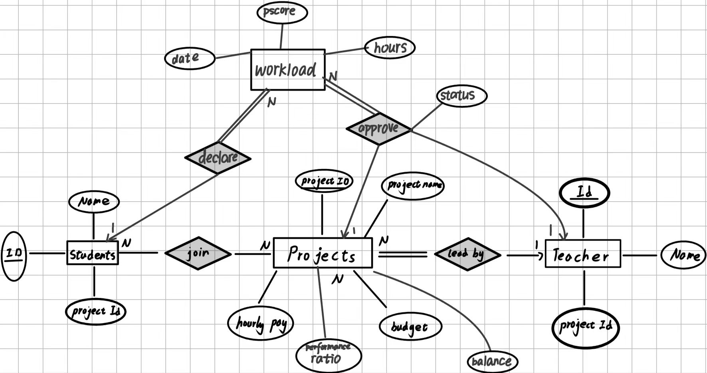

# **Login System**  

## 1.Organizational and Role Analysis

### Three user roles can log in to the frontend: **Student**, **Teacher**, and **Admin**.  


### **Student Permissions**  
1. **View Projects**  
   - Access participating projects with details:  
     - `project_id`  
     - `project_name`  
     - `base_hourly_pay` of the project  
     - `payment_history`  

2. **Performance & Wage Tracking**  
   - After the teacher evaluates performance_score, students can view:  
     - `wage_payment_date`  
     - `performance_score` from the teacher  
     - `final_wage` calculated as:  
       ```
       wage = (performance_rating × performance_score) + (working_hours × base_hourly_pay)
       ```  
   - **Editable Field**:  
     - Students can only submit/modify their own `working_hours`.  

---

### **Teacher Permissions**  
1. **Manage Projects**  
   - View all projects they lead and their participants, including:  
     - `project_id`  
     - `project_name`  
     - `project_budget` 
     - `student_id`
     - `student_name`

2. **Student Evaluation, Project Rating & Wage Configuration**  
   - Assign a `performance_rating` to each project.
   - When a teacher approves a student's working hours, they will assign a `performance_score​` to the student.  
   - ```
     wage = (performance_rating × performance_score) + (working_hours × base_hourly_pay)
     ```  

---

### **Admin Permissions**  
1. **Project Oversight**  
   - View all projects with details and their participants:  
     - `project_id`  
     - `project_name`  
     - `project_budget`
     - `student_id`
     - `student_name`  

2. **Full Editing Privileges**  
   - Modify:  
     - `project_budget`  
     - `base hourly pay` of projects
     - `performance_rating` to each project  
     - Student-project assignments (add/remove students from projects).  

3. **Reporting**  
   - Generate and view annual summary reports.  

---

## 2.Business Process Analysis

### **1. Student Submits/Modifies Working Hours**  
**Initiator**: Student  
**Steps & Data**:  
1. The student logs into the system and navigate to their enrolled project page.  
2. Enters or modifies the `working_hours` field in the project details and submits the form.  
3. The system validates the data format (e.g., numeric value, within a reasonable range).  

**Expected Output**:  
- Updates the `working_hours` value in the database upon successful submission.  
- Triggers the next step: Teachers can review and approve/score the student’s working hours.  

---

### **2. Teacher Approves Working Hours and Assigns Performance Score**  
**Initiator**: Teacher  
**Steps & Data**:  
1. The teacher logs in, navigates to their managed project page, and reviews the student-submitted `working_hours`.  
2. Validates the reasonableness of the working hours (e.g., alignment with project timelines).  
3. After approval, assigns a `performance_score` to the student.  
4. The system automatically calculates the `final_wage` using the formula:  
   ```  
   final_wage = (performance_rating × performance_score) + (working_hours × base_hourly_pay)  
   ```  
**Expected Output**:  
- Updates the student’s `performance_score` and associated `final_wage`.  
- The student can view the approval status and final wage on their interface.  


---

### **3. Admin Manages Project Budget & Student Assignments**  
**Initiator**: Admin  
**Steps & Data**:  
1. The Admin modifies `project_budget` (project budget), `base_hourly_pay` (base hourly rate), `performance_rating` in the project management interface.  
2. Adds/removes students via the "Student-Project Assignment" module using `student_id` or `student_name`.  
3. The system validates budget changes (e.g., ensuring the new budget does not fall below total wages already disbursed).  

**Expected Output**:  
- Updates project metadata (budget, hourly rate, performance_rating).  
- Adjusts student enrollment relationships, which are reflected in Teacher/Student views.  

---

### **4. Admin Generates Annual Summary Report**  
**Initiator**: Admin  
**Steps & Data**:  
1. The Admin selects a time range (e.g., fiscal year) and clicks "Generate Report" in the reporting interface.  
2. The system aggregates data, including:  
   - `project_budget` utilization across all projects.  
   - Total wages disbursed to students.  
   - Distribution of teacher-assigned `performance_score` (e.g., average scores).

**Expected Output**:  
- A downloadable or previewable PDF/Excel report with charts and tables summarizing annual data.  
---

### Bonus: use-case diagrams

**Students**

**Teachers**

**Admin**


## 3. Data Flow Diagrams (DFDs)


## 4. ER Diagram


## 5. Performance Testing

### 1.Test Key Operations
```
Average Admin login: 0.003s
Average Teacher login: 0.002s
Average Student login: 0.002s
Average Admin add project: 0.004s
Average Admin get projects: 0.052s
Average Admin update project: 0.009s
Average Admin delete project: 0.008s
Average Admin annual report: 0.019s
Average Student get projects: 0.003s
Average Student declare working hours: 0.007s
Average Student cancel working hours: 0.011s
Average Student get working hours: 0.017s
Average Student wage history: 0.017s
Average Teacher get projects: 0.007s
Average Teacher get project students: 0.006s
Average Teacher approve working hours: 0.010s
Average Teacher reject working hours: 0.010s
Average Teacher wage paid condition: 0.006s
Average Teacher pay wage: 0.015s
```

### 2. Analyze and Report
| Operation Name                | Test Dataset Size            | Average Runtime (s) |
| ----------------------------- | ---------------------------- | ------------------- |
| Admin login                   | 1 admin                      | 0.003               |
| Teacher login                 | 1000 teachers                | 0.002               |
| Student login                 | 50000 students               | 0.002               |
| Admin add project             | 3333 projects                | 0.004               |
| Admin get projects            | 3333 projects                | 0.052               |
| Admin update project          | 3333 projects                | 0.009               |
| Admin delete project          | 3333 projects                | 0.008               |
| Admin annual report           | System-wide (all users/data) | 0.019               |
| Student get projects          | 50000 students               | 0.003               |
| Student declare working hours | 50000 students               | 0.007               |
| Student cancel working hours  | 50000 students               | 0.011               |
| Student get working hours     | 50000 students               | 0.017               |
| Student wage history          | 50000 students               | 0.017               |
| Teacher get projects          | 1000 teachers                | 0.007               |
| Teacher get project students  | ≈ 1000 teachers              | 0.006               |
| Teacher approve working hours | ≈ 1000 teachers              | 0.010               |
| Teacher reject working hours  | ≈ 1000 teachers              | 0.010               |
| Teacher wage paid condition   | ≈ 1000 teachers              | 0.006               |
| Teacher pay wage              | ≈ 1000 teachers              | 0.015               |
As you can see, all the operations are quick and efficient 